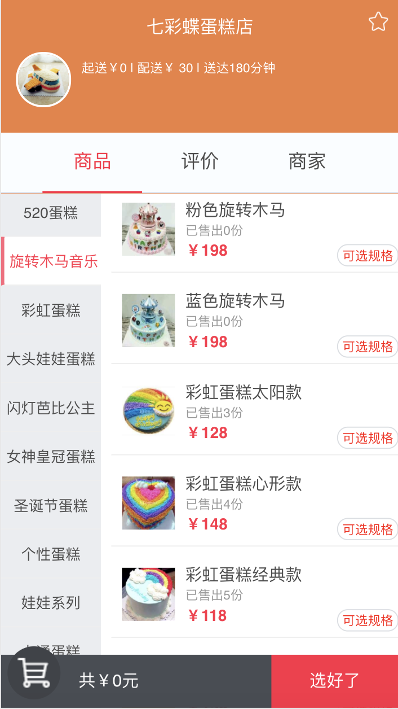

## 基于vue2+vue-router+webpack仿百度外卖项目


> A Vue.js project

The vue project is just for fun and learning,there are still have some compatibility bug on ios device.

Still underConstruction.

DEMO: [https://github.com/HanMhui/takeOut](https://github.com/HanMhui/takeOut)

use chrome mobile device mode

## Build Setup


>install dependencies

```
$ yarn
```
>serve with hot reload at localhost:8080

```
$ npm run dev
```

>mock server with hot reload at localhost:3000
```
$ npm run mock
```

>build for production with minification

```
npm run build
```

>效果



<br />


<br />


<br />


>scan it on mobile device


